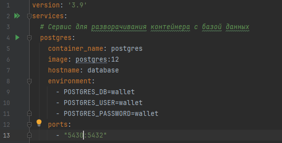
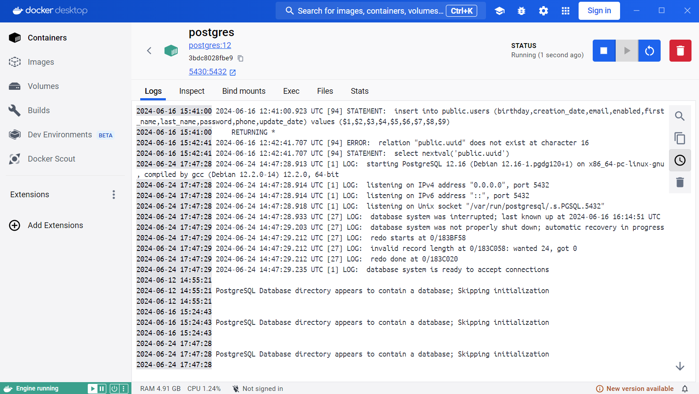
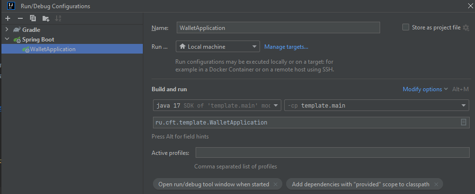
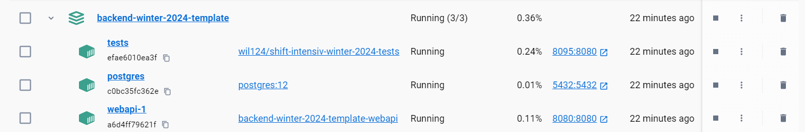

# Настройка и запуск проекта

Необходимо установить или иметь на ПК:

* JDK 17+ LTS
* Gradle (совместимый с версией java https://docs.gradle.org/8.8-rc-1/userguide/compatibility.html)
* Docker + docker-compose, если хотите поднимать БД и приложение в контейнере. 
Рекомендуется установить [Docker desktop](https://www.docker.com/products/docker-desktop/)

## База данных PostgreSQL

### Запуск в контейнере (рекомендуемый)

* Находясь в корне проекта, выполните команду `docker-compose up postgres`
* Или нажмите кнопку "Play" рядом с контейнером
  postgres 
  У вас появится БД с созданной схемой и пользователем,
  указанным в разделе environment файла [docker-compose.yml](docker-compose.yml)  
  Созданная БД доступна по адресу
    * `localhost:5430` - локально
    * `database:5432` - внутри сети docker
* Также можете управлять контейнером через Docker desktop 

### Локальный запуск
Вам необходимо:
* Установить PostgreSQL локально, в зависимости от вашей ОС.  
* Создать схему wallet в вашей БД
* Создать пользователя wallet:wallet

## Сервисное приложение

Приложение будет доступно по адресу `http://localhost:8080` или [click](http://localhost:8080)  
Для запуска приложения требуется [запустить БД](#база-данных-postgresql)
После запуска приложения, будет автоматически выполнен накат миграций Flyway.
### Локальный запуск (рекомендуемый)

Локальный запуск удобен для разработки и постоянных изменений в коде.  
Способы запуска: 
* Выполнив команду `gradle bootRun`
* В Intellij IDEA (или иной среде разработки), используя следующие параметры для запуска: 
2. Выполнить `docker compose up`. Проверяем в Docker Desktop что все контейнеры запустились
   

### Запуск в контейнере
* Выполнив команду `gradle assemble` для создания jar-файла.
* Если всё ОК, у вас должен появится исполняемый .jar файл (build/libs/template-0.0.1.jar)
  После, поднимте контейнер `webapi` аналогично [запуску БД в контейнере](#запуск-в-контейнере-рекомендуемый)